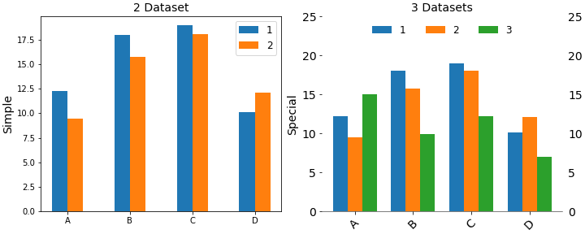
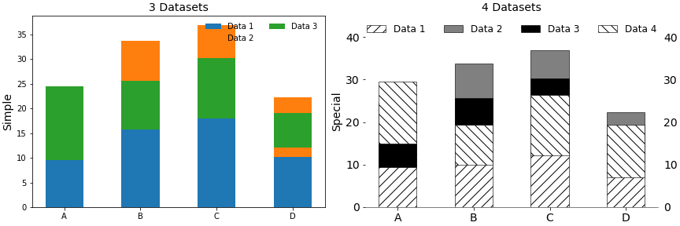
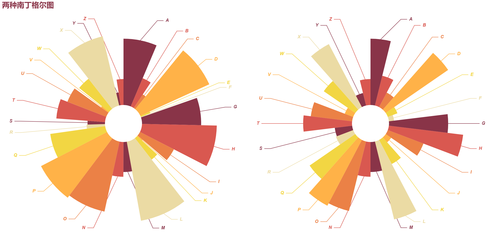
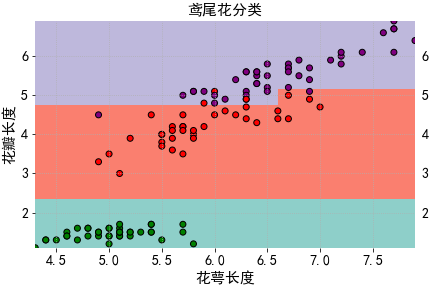
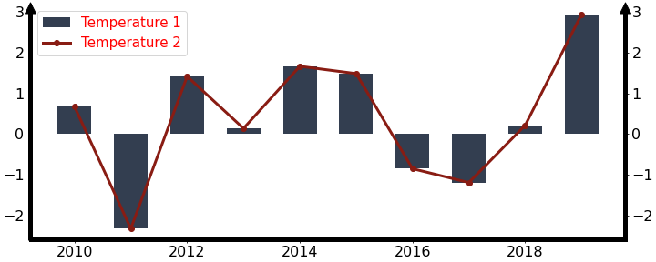

# ScienceGallery

- The repository is my code for various types of data visualization cases based on the Matplotlib library. 
- It summarizes the code and case studies for building the different types of graphs needed in the competition and research process. It is for memo purposes only.

-------------------------

## Bar Picture

1. **堆叠柱形图**-[Github](https://github.com/xwj770427414/ScienceGallery/tree/main/Bar/Stacked_Bar.ipynb)/[Gitee](https://gitee.com/xwj770427414/ScienceGallery/tree/main/Bar/Stacked_Bar.ipynb)

## Pie Picture

1. **南丁格尔图**-[Github](https://github.com/xwj770427414/ScienceGallery/tree/main/Pie/Rosetype.ipynb)/[Gitee](https://gitee.com/xwj770427414/ScienceGallery/tree/main/Pie/Rosetype.ipynb)

## Combination Picture
### Classified Picture

1. **矩形网格色块背景分类图**-[Github](https://github.com/xwj770427414/ScienceGallery/tree/main/Classification/Grid_background.ipynb)/[Gitee](https://gitee.com/xwj770427414/ScienceGallery/tree/main/Combination/Classification/Grid_background.ipynb)

### Sequence Picture
1. **柱形折线图**-[Github](https://github.com/xwj770427414/ScienceGallery/tree/main/Sequence/Column_Line.ipynb)/[Gitee](https://gitee.com/xwj770427414/ScienceGallery/tree/main/Combination/Sequence/Column_Line.ipynb)

